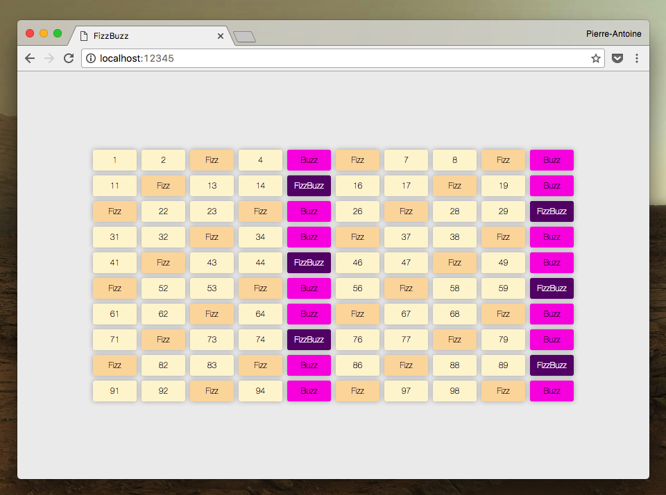

# FizzBuzz

> JavaScript Revision exercise

* * *

**fizzbuzz** is an educational project.

**Note:** the school where the course is given, the [HEPL](http://www.provincedeliege.be/hauteecole) from Liège, Belgium, is a french-speaking school. From this point, the instructions will be in french. Sorry.

* * *

Vous avez 30 minutes pour reproduire le rendu suivant en complétant les trois fichiers fichiers `index.html`, `styles.css` & `script.js`.

Le fichier html ne comprendra, comme vous avez pû le deviner, qu'une balise `ul` vide qui sera remplie *via* javascript.

Chaque élément contiendra une nombre, qui sera remplacé par le mot **Fizz** si ce nombre est un multiple de 3, par **Buzz** si c'est un multiple de 5, et par **FizzBuzz** si c'est un multiple de 3 et 5.

Concernant les styles, chaque élément a pour couleur de fond `#fff5d7` si c'est un nombre quelconque, `#ffdbad` pour les cases **Fizz**, `#ff0ce1` pour les cases **Buzz** et `#670074` pour les cases **FizzBuzz**.

J'attends de vous un code clair, concis et lisible.

Bon travail.
